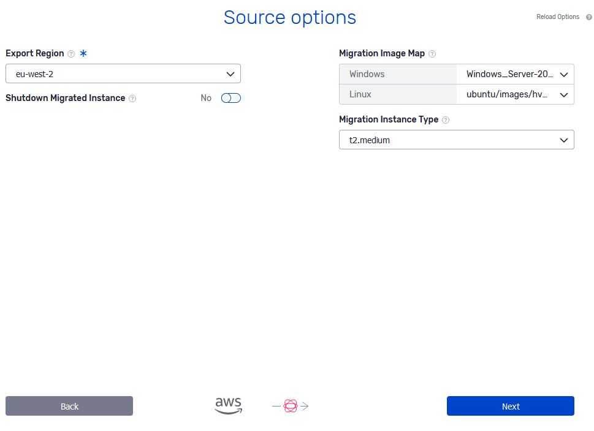

# AWS as a source cloud

### Migrating (CMaaS) from AWS

Migrations from AWS operate in the same way Replicas do and thus entail the same requirements and steps described below.

### Replicating (DRaaS) from AWS

**Input** : the ID or "Name" tag of the instance. The instance must be in the same **region** parameter supplied in the connection info used to create the AWS Coriolis endpoint.

**Steps performed by Coriolis** :

Considering there are no publicly-available APIs for fetching the contents of disks of instances off of AWS, the AWS Coriolis plugin must bypass the issue by booting a temporary machine to read the contents of the disks through.

  1. read the configuration of the instance on the source AWS (flavor information, disks, etc…)
  2. create EBS snapshots of all the volumes of the instance and create new volumes from them
  3. create a temporary instance on AWS (the "disk replication worker") and attach the volumes created in step 2
  4. compute the state of the disks (i.e. hash the disk chunks)
  5. if this is the first Replica execution, read all non-zero disk chunks and pass them to the destination plugin  
If this is incremental sync, only the chunks which have changed from the previous Replica execution are transferred.
  6. delete the temporary replication  created at step 3 and its attached disks
  7. remove the volume snapshots created at step 2, along with any other temporary resources used in the disk copy process (such as the key pair for the disk copy worker)

During step 5, the changed blocks are transferred and written to disks on the destination platform via the destination cloud plugin.

### Configuration Options

Below is a listing of the configuration section needed when migrating from AWS:

**Configuration options for AWS as a migration source**

[aws_migration_provider] #Name of the instance type to be used for the disk copy workers. #Default is t2.medium. worker_instance_type = t2.medium #Indicate whether or not to shut the VM down during the #migration process in order to ensure data consitency. #shutdown_migrated_instance = false 

1234567 | [aws_migration_provider] #Name of the instance type to be used for the disk copy workers. #Default is t2.medium. worker_instance_type = t2.medium #Indicate whether or not to shut the VM down during the #migration process in order to ensure data consitency. #shutdown_migrated_instance = false   
---|---  
  
### OSMorphing steps taken when migrating from AWS

For HVM guests, Coriolis will take the following OSMorphing steps as part of the migration process from AWS:

**Linux:**

  * uninstalling cloud-init

### OSMorphing and temporary worker VM images

During the disk export and OSMorphing processes, Coriolis will create temporary VMs in order to facilitate the Migration process.

The images do **NOT** require any special Coriolis agent running in them and can be images already available in the AWS marketplace, granted the following requirements:

**Linux** :

  * needs to be Ubuntu 16.04 or 18.04 (using official Canonical 18.04 images is recommended)
  * AMI must have only one disk (regardless of instance storage or EBS-backed)
  * cloud-init must be installed and running in order for the initial setup/login and key injection to succeed

**Windows** :

  * for OSMorphing, must be of at least the same version as the guest of the VM being migrated
  * the Windows image should have the AWS Windows agent tools configured for the first boot

### AWS source environment parameters

The source environment parameters are a set of source-cloud-specific parameters that offer some extra options to the migration/replication process on a per-VM basis.

Below is a listing of the destination environment parameters the AWS plugin supports when migrating/replicating a VM from AWS:

**Example of source environment JSON to be passed to the AWS plugin**

{ "migr_image_map": {"linux": "ami-50946030", "windows": "ami-50946031"}, "worker_instance_type": "t2.medium", "shutdown_migrated_instance": false }

12345 | {     "migr_image_map": {"linux": "ami-50946030", "windows": "ami-50946031"},     "worker_instance_type": "t2.medium",     "shutdown_migrated_instance": false }  
---|---  
  
Each parameter represents:

  * **migr_image_map (string-string mapping)** - a mapping specifying the ID of an AMI to use for temporary worker VMs. Supported keys are Linux and windows.
  * **worker_instance_type (string)** - name of the instance type to use for the temporary worker VMs. The default is t2.medium.
  * **shutdown_migrated_instance (string)** - Indicate whether or not to shut the VM down during the migration process in order to ensure data consistency.

