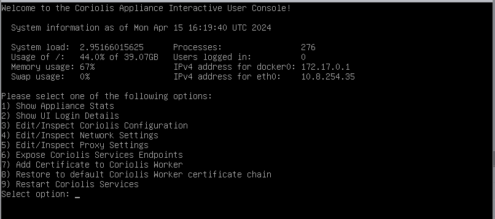
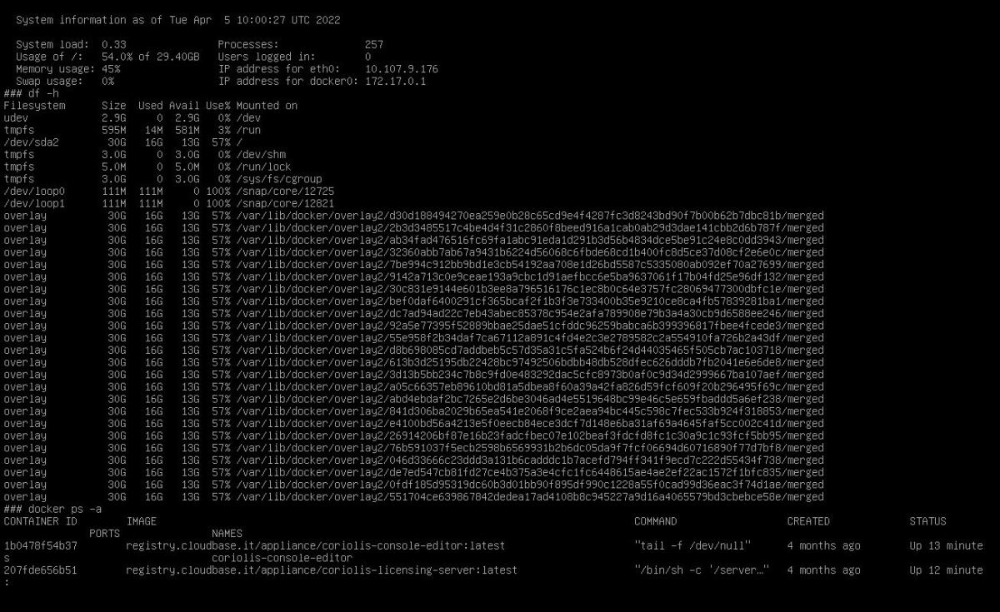
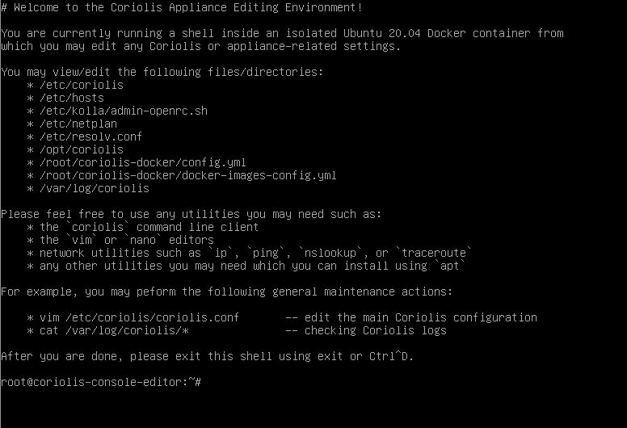
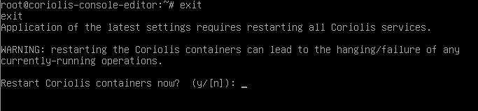
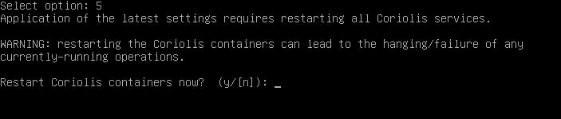

# Coriolis Console Menu

Coriolis Console Menu is represented by the **Interactive User Console** , accessed via serial console after the Coriolis Appliance deployment is complete.

The Console Menu has several options available:

  * **Show Appliance Stats**  
This option will provide the system status and stats for all docker containers, which run all the Coriolis components

  * **Show UI Login Details**  
This option will provide the necessary information (**URL, username and password**) to access the Coriolis UI.

  * **Edit/Inspect Coriolis Configuration**  
This option will open a shell session called **Coriolis Appliance Editing Environment** which will allow access to configuration files and logs.  
A list will be shown upon opening the shell session, providing the files and directories of interest.

NOTE: This shell session can also be used to interact with your OpenStack environment (if any), as OpenStack CLI is available on the Coriolis Appliance out of the box. Sourcing the RC file will allow access/control over your OpenStack environment using Coriolis Appliance.

After editing any Coriolis files, it is mandatory to restart the Coriolis Services for the changes to take effect. Upon exiting the shell session you will be prompted to restart the Coriolis Services.

  * **Edit/Inspect Network Settings**  
This option will again open the shell session called **Coriolis Appliance Editing Environment** , which offers the option of editing network configurations.  

NOTE: The **Network Settings** are only applied **after** you edit the configurations and the **Coriolis Services** are **restarted** , so to validate them, please use the **Edit/Inspect Coriolis Configuration** option.

  * **Restart Coriolis Service**  
This option offers the capability of restarting the services without interacting with other menus.

**Proxy settings**  
The Proxy options set here will apply to the Coriolis appliance itself, including the internal Coriolis worker that communicates with the cloud endpoints.

For changing the proxy settings to be used during OSMorphing stage, the coriolis.conf [proxy] section will have to be changed.
