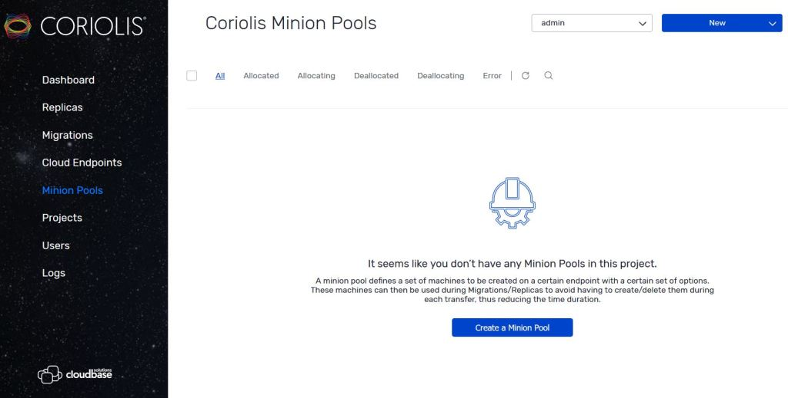
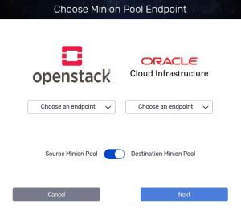
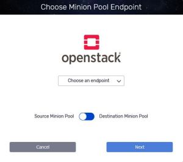
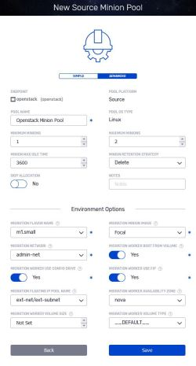
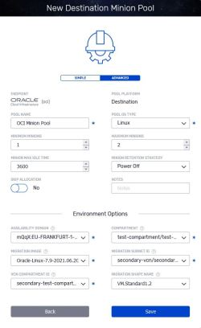
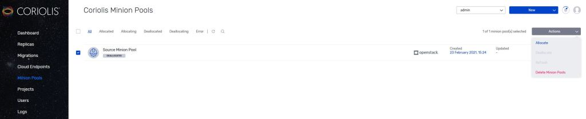
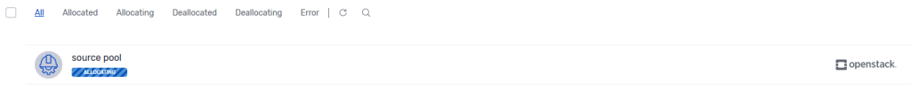
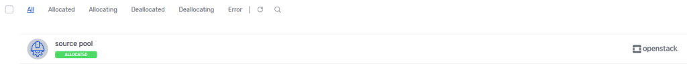
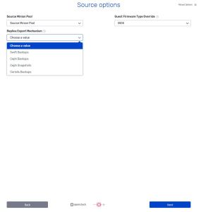

# Coriolis Minion Pools operations and usage

### Minion Pools

Coriolis relies on temporary virtual machines (commonly called “minion machines“), which it deploys on the source/target platforms to perform various actions during transfer operations, such as:

  * export the disk data of VMs being transferred from a source platform (in cases where Coriolis-based Replication is used) 
  * receive and write the exported disk data onto disks on the destination platform 
  * performing the OSMorphing process (where a temporary VM modifies a transferred machine's VM image to ensure it will boot properly on the target platform) 

The current supported platforms for Minion Pools are:

  * **source platforms:**
    * OpenStack
  * **destination platforms:**
    * SUSE Virtualization 
      * this also covers any KubeVirt and Harvester-based platforms
    * OpenStack
    * OCI

Additional platforms to be supported in future releases.

By default, Coriolis automatically creates and cleans up all of the temporary resources it needs throughout the duration of the transfer, thus only limiting resources used to the duration of the transfer itself, but at the cost of time overhead for the actual creation/cleanup of the temporary resources. 

In cases where resource usage limitations are not a factor, or where the time cost outweighs the resource allocation costs, Coriolis offers the ability to pre-allocate the Minion Machines on source/destination platforms into so-called “Minion Machine Pools”.

###  Minion Pool Creation and Management 

For most of the supported plugins, the set of parameters related to Minion Pool Machines are usually shared with the Destination Environment parameters to allow for the dynamic selection of whether or not to use a minion pool or perform creation/cleanup of temporary resources as usual. 

A new minion pool for a given Coriolis Cloud Endpoint can be created using the following: 

  * From Coriolis' **Dashboard** , go to **Minion Pools** and select **Create a Minion Pool**

  * Select **Source/Destination Minion Pool** depending on the platform that will be used with Minion Pools.
  * Select the **Endpoint** that you want to create the **Minion Pool** , and whether this will be a source or a destination minion pool.   
Endpoints can have as many source and destination pools defined for them as desired.

  * The following step will provide a list of **parameters** for the **Minion Pool** to be created

The available parameters for minion pools include: 

  1. **Pool OS Type** : the OS type ('Linux', 'Windows') for the Minion Pool. Source Minion Pools require them to be of OS type Linux to be able to run the data exports during VM transfers. 
  2. **Minimum Minions** : strictly positive number of Minion Machines the pool should contain once allocated. 
  3. **Maximum Minions** : the maximum amount of Minions to which the Minion Pool can scale and use for Replica/Migration jobs (Minions are limited to **one Minion per transfer**)
  4. **Minion Max Idle Time** : the amount of time (in seconds) before the Minion Retention applies  
This value is set to 3600 seconds by default in **coriolis.conf** file
  5. **Minion Retention Strategy** : whether to delete or power off Minions that met the **Max Idle Time** (Retention does not apply to the minimum amount of Minions selected at point 4)
  6. **Skip Allocation** : the Minion Pool will be created without allocating the resources for the Minions. When the Minion Pool is to be used **the Minion Pool resources can be allocated as shown in the example* below**.
  7. **Environment Options** : Platform-specific parameters for the Minion Pool. These will generally include options such as which image to use for the Minions and other similar minion-machine-related properties 

Automatic health checks can be set to be performed at a specified interval measured in minutes.   
The health checks will verify the power state of the minion and perform cleanups if required, based on **Minion Max Idle Time** by applying the selected retention (**Minion Retention Strategy**) upon creating the minion pool. This feature is disabled by default.

It can be set up by:

  * connecting to the Coriolis CLI
  * navigating to and editing **/etc/coriolis/coriolis.conf**
  * set new value for **minion_pool_default_refresh_period_minutes** (amount is measured in minutes) and save the file
  * run **docker restart coriolis-minion-manager** to apply the changes

_allocating resources example*_

  * Before being able to use the newly created **Minion Pool** , its initial **allocation process** must be completed.

###  Using Minion Pools for Migrations/Replicas 

Once created, Minion Pools can then be used when creating the transfer jobs as shown below: 

The following example is using OpenStack as **source Endpoint** and VMWare as **destination Endpoint** , the chosen export mechanism is **Coriolis Backups** (where Minion machines are required):

The parameters for Source Options are the following:

  * **Source Minion Pool** : selecting one of the source Minion Pools (if multiple) to be used to the current job of Replica/Migration
  * **Guest Firmware Override** : it can be used to override the firmware type read by Coriolis of the source instance's **Glance image/Cinder volume**
  * **Replica Export Mechanism** : what Replica export implementation to use 
    * if set to **Coriolis Backups** : Coriolis will create a temporary VM on the source to export the snapshots
    * if set to **Swift Backups** : Coriolis will create a Cinder backup for the disks and fetch the backup objects from Swift
    * If set to **Ceph Backups** : Coriolis will create a Cinder backup and will connect to the source Ceph via RADOS and retrieve chunks of disks.
    * if set to **Ceph snapshots** : Coriolis will create a Cinder snapshot for the disks and fetch the diff chunks from the source Ceph.

The steps that follow the ones mentioned above are identical to **[OpenStack Replica/Migration](https://cloudbase.it/openstack-as-a-destination-cloud)**.

Coriolis Minion Pools can also be fully managed using CLI. For more information, please check **[Coriolis CLI](https://cloudbase.it/coriolis-cli)** page.
