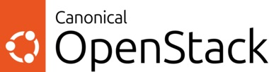

# Coriolis® Cloud Migration as a Service

[vc_row type="vc_default" full_width="stretch_row" gap="30″ content_placement="middle" bg_type="bg_color" bg_color_value="#e2e2e2″ css=".vc_custom_1550135880307{margin-top: -60px !important;}"][vc_column width="1/6″][/vc_column][vc_column width="2/3″][vc_column_text]

### Coriolis® is the simplest way to migrate Windows or Linux virtual machines alongside their associated storage and networking configurations across multiple cloud platforms.

[/vc_column_text][/vc_column][vc_column width="1/6″][/vc_column][/vc_row][vc_row type="vc_default"][vc_column][vc_row_inner content_placement="middle" gap="30″][vc_column_inner width="1/6″][/vc_column_inner][vc_column_inner width="2/3″][vc_single_image image="37967″ img_size="full"][/vc_column_inner][vc_column_inner width="1/6″][/vc_column_inner][/vc_row_inner][vc_row_inner][vc_column_inner width="1/2″ offset="vc_col-lg-offset-1 vc_col-lg-5″][vc_column_text]

**Coriolis®** performs software defined migrations of virtual workloads among different clouds and virtualization solutions at scale, while also supporting **DRaaS** (disaster recovery as a service) scenarios, for moving from traditional virtualization technologies to modern cloud infrastructure.

[/vc_column_text][/vc_column_inner][vc_column_inner width="1/2″ offset="vc_col-lg-offset-0 vc_col-lg-5″][vc_column_text]

Coriolis truly excels in automating cloud migration in a scalable and reliable way, avoiding the need for countless manual steps, notoriously error prone and barely documented.

[/vc_column_text][/vc_column_inner][/vc_row_inner][/vc_column][/vc_row][vc_row type="vc_default"][vc_column][vc_empty_space height="50px"][vc_empty_space height="50px"][/vc_column][/vc_row][vc_row type="vc_default" anchor="features"][vc_column offset="vc_col-lg-offset-1 vc_col-lg-10 vc_col-md-offset-0 vc_col-md-12 vc_col-sm-offset-0″][vc_row_inner gap="35″][vc_column_inner width="1/3″][vc_column_text css_animation="fadeIn"]

###  Agentless

[/vc_column_text][vc_empty_space height="1px"][vc_column_text]

No Coriolis component is needed to be pre-installed on guest VMs for them to be migrated / replicated and neither are guest credentials required.

[/vc_column_text][/vc_column_inner][vc_column_inner width="1/3″][vc_column_text css_animation="fadeIn"]

###  Secure

[/vc_column_text][vc_empty_space height="1px"][vc_column_text]

All external API/data transfer operations Coriolis performs are done through secure protocols such as HTTPS and SSH.

[/vc_column_text][/vc_column_inner][vc_column_inner width="1/3″][vc_column_text css_animation="fadeIn"]

###  Scalable Architecture

[/vc_column_text][vc_column_text]

Any number of migrations/replicas can be performed at a given time, limited only by the underlying resource availability, storage or network IO and QoS rules.

[/vc_column_text][vc_empty_space height="1px"][/vc_column_inner][/vc_row_inner][vc_empty_space height="20px"][vc_row_inner gap="35″][vc_column_inner width="1/3″][vc_column_text css_animation="fadeIn"]

###  Data Replication with Zero Downtime

[/vc_column_text][vc_empty_space height="1px"][vc_column_text]

Running VMs can be replicated with zero impact on business continuity given the underlying infrastructure supports live-snapshotting.

[/vc_column_text][/vc_column_inner][vc_column_inner width="1/3″][vc_column_text css_animation="fadeIn"]

###  Integrated Scheduler

[/vc_column_text][vc_empty_space height="1px"][vc_column_text]

Replicas can be scheduled to be executed automatically at fixed times or with a given frequency.

[/vc_column_text][/vc_column_inner][vc_column_inner width="1/3″][vc_column_text css_animation="fadeIn"]

###  REST API and a friendly UI

[/vc_column_text][vc_empty_space height="1px"][vc_column_text]

The user can interact with Coriolis either through its REST API or through a modern Web UI.

[/vc_column_text][/vc_column_inner][/vc_row_inner][/vc_column][/vc_row][vc_row type="vc_default"][vc_column offset="vc_col-lg-offset-1 vc_col-lg-10 vc_col-md-offset-0 vc_col-md-12 vc_col-sm-offset-0″][vc_empty_space height="50px"]

Supported Cloud Providers

[vc_row_inner][vc_column_inner][vc_empty_space height="40px"][vc_column_text]

In order for Coriolis to create a migration or a replica, connections to source and destination clouds, called **cloud endpoints** are necessary. Coriolis supports a lot of providers and a growing list of new supported clouds.

[/vc_column_text][vc_raw_html]JTNDc3R5bGUlM0UlMEElMjAlMjAucm93JTIwJTdCJTBBJTIwJTIwJTIwJTIwZGlzcGxheSUzQSUyMGZsZXglM0IlMEElMjAlMjAlMjAlMjBqdXN0aWZ5LWNvbnRlbnQlM0ElMjBzcGFjZS1iZXR3ZWVuJTNCJTBBJTIwJTIwJTdEJTBBJTIwJTIwLmNvbHVtbiUyMCU3QiUwQSUyMCUyMCUyMCUyMHdpZHRoJTNBJTIwNTAlMjUlM0IlMEElMjAlMjAlN0QlMEElMjAlMjAucm93JTIwdWwlMjAlN0IlMEElMjAlMjAlMjAlMjBsaXN0LXN0eWxlLXR5cGUlM0ElMjBub25lJTNCJTBBJTIwJTIwJTIwJTIwbWFyZ2luJTNBJTIwMCUzQiUwQSUyMCUyMCUyMCUyMHBhZGRpbmclM0ElMjA0MHB4JTNCJTBBJTIwJTIwJTIwJTIwZm9udC1zaXplJTNBJTIwMThweCUzQiUwQSUyMCUyMCU3RCUwQSUyMCUyMC5yb3clMjBsaSUyMCU3QiUwQSUyMCUyMCUyMCUyMGRpc3BsYXklM0ElMjBmbGV4JTNCJTBBJTIwJTIwJTIwJTIwYWxpZ24taXRlbXMlM0ElMjBjZW50ZXIlM0IlMEElMjAlMjAlMjAlMjBtYXJnaW4tYm90dG9tJTNBJTIwMjVweCUzQiUwQSUyMCUyMCU3RCUwQSUyMCUyMC5yb3clMjBpbWclMjAlN0IlMEElMjAlMjAlMjAlMjB3aWR0aCUzQSUyMDU4cHglM0IlMEElMjAlMjAlMjAlMjBtYXJnaW4tcmlnaHQlM0ElMjAxMHB4JTNCJTBBJTIwJTIwJTdEJTBBJTNDJTJGc3R5bGUlM0UlMEElM0NkaXYlMjBjbGFzcyUzRCUyMnJvdyUyMiUzRSUwQSUyMCUyMCUzQ2RpdiUyMGNsYXNzJTNEJTIyY29sdW1uJTIyJTNFJTBBJTIwJTIwJTIwJTIwJTNDdWwlM0UlMEElMjAlMjAlMjAlMjAlMjAlMjAlM0NsaSUzRSUwQSUyMCUyMCUyMCUyMCUyMCUyMCUyMCUyMCUzQ2ltZyUyMHNyYyUzRCUyMmh0dHBzJTNBJTJGJTJGY2xvdWRiYXNlLml0JTJGd3AtY29udGVudCUyRnVwbG9hZHMlMkYyMDIyJTJGMTElMkZCbGFuay1kaWFncmFtLnBuZyUyMiUzRSUwQSUyMCUyMCUyMCUyMCUyMCUyMCUyMCUyMCUzQ2ElMjB0aXRsZSUzRCUyMkJhcmUlMjBNZXRhbCUyMHAydiUyMiUyMGhyZWYlM0QlMjJodHRwcyUzQSUyRiUyRmNsb3VkYmFzZS5pdCUyRmNvcmlvbGlzLWJhcmUtbWV0YWwtaHViLXBsdWdpbiUyRiUyMiUyMHRhcmdldCUzRCUyMl9ibGFuayUyMiUyMHJlbCUzRCUyMm5vb3BlbmVyJTIyJTNFQmFyZSUyME1ldGFsJTIwTWlncmF0aW9ucyUzQyUyRmElM0UlMEElMjAlMjAlMjAlMjAlMjAlMjAlM0MlMkZsaSUzRSUwQSUyMCUyMCUyMCUyMCUyMCUyMCUzQ2xpJTNFJTBBJTIwJTIwJTIwJTIwJTIwJTIwJTIwJTIwJTNDaW1nJTIwc3JjJTNEJTIyaHR0cHMlM0ElMkYlMkZjbG91ZGJhc2UuaXQlMkZ3cC1jb250ZW50JTJGdXBsb2FkcyUyRjIwMjIlMkYwNyUyRlZtd2FyZS5zdmcucG5nJTIyJTNFJTBBJTIwJTIwJTIwJTIwJTIwJTIwJTIwJTIwJTNDYSUyMHRpdGxlJTNEJTIyVk1XYXJlJTIwQ29yaW9saXMlMjBQbHVnaW4lMjIlMjBocmVmJTNEJTIyaHR0cHMlM0ElMkYlMkZjbG91ZGJhc2UuaXQlMkZ2bXdhcmUtY29yaW9saXMtcGx1Z2luJTJGJTIyJTIwdGFyZ2V0JTNEJTIyX2JsYW5rJTIyJTIwcmVsJTNEJTIybm9vcGVuZXIlMjIlM0VWTVdhcmUlMjB2U3BoZXJlJTNDJTJGYSUzRSUwQSUyMCUyMCUyMCUyMCUyMCUyMCUzQyUyRmxpJTNFJTBBJTIwJTIwJTIwJTIwJTIwJTIwJTNDbGklM0UlMEElMjAlMjAlMjAlMjAlMjAlMjAlMjAlMjAlM0NpbWclMjBzcmMlM0QlMjJodHRwcyUzQSUyRiUyRmNsb3VkYmFzZS5pdCUyRndwLWNvbnRlbnQlMkZ1cGxvYWRzJTJGMjAyMiUyRjA3JTJGb3BlbnN0YWNrLnBuZyUyMiUzRSUwQSUyMCUyMCUyMCUyMCUyMCUyMCUyMCUyMCUzQ2ElMjB0aXRsZSUzRCUyMk9wZW5TdGFjayUyMENvcmlvbGlzJTIwUGx1Z2luJTIyJTIwaHJlZiUzRCUyMmh0dHBzJTNBJTJGJTJGY2xvdWRiYXNlLml0JTJGb3BlbnN0YWNrLWNvcmlvbGlzLXBsdWdpbiUyRiUyMiUyMHRhcmdldCUzRCUyMl9ibGFuayUyMiUyMHJlbCUzRCUyMm5vb3BlbmVyJTIyJTNFT3BlblN0YWNrJTNDJTJGYSUzRSUwQSUyMCUyMCUyMCUyMCUyMCUyMCUzQyUyRmxpJTNFJTBBJTIwJTIwJTIwJTIwJTIwJTIwJTNDbGklM0UlMEElMjAlMjAlMjAlMjAlMjAlMjAlMjAlMjAlM0NpbWclMjBzcmMlM0QlMjJodHRwcyUzQSUyRiUyRmNsb3VkYmFzZS5pdCUyRndwLWNvbnRlbnQlMkZ1cGxvYWRzJTJGMjAyMiUyRjA3JTJGYXdzLnBuZyUyMiUzRSUwQSUyMCUyMCUyMCUyMCUyMCUyMCUyMCUyMCUzQ2ElMjB0aXRsZSUzRCUyMkFXUyUyMENvcmlvbGlzJTIwUGx1Z2luJTIyJTIwaHJlZiUzRCUyMmh0dHBzJTNBJTJGJTJGY2xvdWRiYXNlLml0JTJGYW1hem9uLXdlYi1zZXJ2aWNlcy1hd3MtY29yaW9saXMtcGx1Z2luJTJGJTIyJTIwdGFyZ2V0JTNEJTIyX2JsYW5rJTIyJTIwcmVsJTNEJTIybm9vcGVuZXIlMjIlM0VBbWF6b24lMjBXZWIlMjBTZXJ2aWNlcyUyMCUyOEFXUyUyOSUzQyUyRmElM0UlMEElMjAlMjAlMjAlMjAlMjAlMjAlM0MlMkZsaSUzRSUwQSUyMCUyMCUyMCUyMCUyMCUyMCUzQ2xpJTNFJTBBJTIwJTIwJTIwJTIwJTIwJTIwJTIwJTIwJTNDaW1nJTIwc3JjJTNEJTIyaHR0cHMlM0ElMkYlMkZjbG91ZGJhc2UuaXQlMkZ3cC1jb250ZW50JTJGdXBsb2FkcyUyRjIwMjIlMkYwNyUyRmF6dXJlLnN2ZyUyMiUzRSUwQSUyMCUyMCUyMCUyMCUyMCUyMCUyMCUyMCUzQ2ElMjB0aXRsZSUzRCUyMk1pY3Jvc29mdCUyMEF6dXJlJTIwQ29yaW9saXMlMjBQbHVnaW4lMjIlMjBocmVmJTNEJTIyaHR0cHMlM0ElMkYlMkZjbG91ZGJhc2UuaXQlMkZtaWNyb3NvZnQtYXp1cmUtYXp1cmVzdGFjay1jb3Jpb2xpcy1wbHVnaW4lMkYlMjIlMjB0YXJnZXQlM0QlMjJfYmxhbmslMjIlMjByZWwlM0QlMjJub29wZW5lciUyMiUzRU1pY3Jvc29mdCUyMEF6dXJlJTIwYW5kJTIwQXp1cmVTdGFjayUyMEh1YiUzQyUyRmElM0UlMEElMjAlMjAlMjAlMjAlMjAlMjAlM0MlMkZsaSUzRSUwQSUyMCUyMCUyMCUyMCUyMCUyMCUzQ2xpJTNFJTBBJTIwJTIwJTIwJTIwJTIwJTIwJTIwJTIwJTNDaW1nJTIwc3JjJTNEJTIyaHR0cHMlM0ElMkYlMkZjbG91ZGJhc2UuaXQlMkZ3cC1jb250ZW50JTJGdXBsb2FkcyUyRjIwMjIlMkYwNyUyRndzMjAyMi5wbmclMjIlM0UlMEElMjAlMjAlMjAlMjAlMjAlMjAlMjAlMjAlM0NhJTIwdGl0bGUlM0QlMjJNaWNyb3NvZnQlMjBIeXBlci1WJTIwQ29yaW9saXMlMjBQbHVnaW4lMjIlMjBocmVmJTNEJTIyaHR0cHMlM0ElMkYlMkZjbG91ZGJhc2UuaXQlMkZoeXBlci12LWNvcmlvbGlzLXBsdWdpbiUyRiUyMiUyMHRhcmdldCUzRCUyMl9ibGFuayUyMiUyMHJlbCUzRCUyMm5vb3BlbmVyJTIyJTNFTWljcm9zb2Z0JTIwSHlwZXItViUzQyUyRmElM0UlMEElMjAlMjAlMjAlMjAlMjAlMjAlM0MlMkZsaSUzRSUwQSUyMCUyMCUyMCUyMCUyMCUyMCUzQ2xpJTNFJTBBJTIwJTIwJTIwJTIwJTIwJTIwJTIwJTIwJTNDaW1nJTIwc3JjJTNEJTIyaHR0cHMlM0ElMkYlMkZyYXcuZ2l0aHVidXNlcmNvbnRlbnQuY29tJTJGY2xvdWRiYXNlJTJGY29yaW9saXMtd2ViJTJGcmVmcyUyRmhlYWRzJTJGbWFpbiUyRnNlcnZlciUyRmFwaSUyRnJlc291cmNlcyUyRnByb3ZpZGVyTG9nb3MlMkZudXRhbml4LTEyOC5zdmclMjIlM0UlMEElMjAlMjAlMjAlMjAlMjAlMjAlMjAlMjAlM0NhJTIwdGl0bGUlM0QlMjJOdXRhbml4JTIwQUhWJTIwQ29yaW9saXMlMjBQbHVnaW4lMjIlMjBocmVmJTNEJTIyaHR0cHMlM0ElMkYlMkZjbG91ZGJhc2UuaXQlMkZudXRhbml4LWFzLWEtc291cmNlLWNsb3VkJTJGJTIyJTIwdGFyZ2V0JTNEJTIyX2JsYW5rJTIyJTIwcmVsJTNEJTIybm9vcGVuZXIlMjIlM0VOdXRhbml4JTIwQUhWJTNDJTJGYSUzRSUwQSUyMCUyMCUyMCUyMCUyMCUyMCUzQyUyRmxpJTNFJTBBJTIwJTIwJTIwJTIwJTIwJTIwJTNDbGklM0UlMEElMjAlMjAlMjAlMjAlMjAlMjAlMjAlMjAlM0NpbWclMjBzcmMlM0QlMjJodHRwcyUzQSUyRiUyRmNsb3VkYmFzZS5pdCUyRndwLWNvbnRlbnQlMkZ1cGxvYWRzJTJGMjAyNCUyRjA4JTJGMTg3MDA3MDMucG5nJTIyJTNFJTBBJTIwJTIwJTIwJTIwJTIwJTIwJTIwJTIwJTNDYSUyMHRpdGxlJTNEJTIyU1VTRSUyMFZpcnR1YWxpemF0aW9uJTIyJTIwaHJlZiUzRCUyMmh0dHBzJTNBJTJGJTJGY2xvdWRiYXNlLml0JTJGa3ViZXZpcnQtaGFydmVzdGVyLWNvcmlvbGlzLXBsdWdpbiUyRiUyMiUyMHRhcmdldCUzRCUyMl9ibGFuayUyMiUyMHJlbCUzRCUyMm5vb3BlbmVyJTIyJTNFU1VTRSUyMFZpcnR1YWxpemF0aW9uJTNDJTJGYSUzRSUwQSUyMCUyMCUyMCUyMCUyMCUyMCUzQyUyRmxpJTNFJTBBJTIwJTIwJTIwJTIwJTIwJTIwJTNDbGklM0UlMEElMjAlMjAlMjAlMjAlMjAlMjAlMjAlMjAlM0NpbWclMjBzcmMlM0QlMjJodHRwcyUzQSUyRiUyRmNsb3VkYmFzZS5pdCUyRndwLWNvbnRlbnQlMkZ1cGxvYWRzJTJGMjAyNCUyRjA4JTJGMTg3MDA3MDMucG5nJTIyJTNFJTBBJTIwJTIwJTIwJTIwJTIwJTIwJTIwJTIwJTNDYSUyMHRpdGxlJTNEJTIyU1VTRSUyMExpbnV4JTIwJTI4S1ZNJTI5JTIyJTIwaHJlZiUzRCUyMmh0dHBzJTNBJTJGJTJGY2xvdWRiYXNlLml0JTJGc3VzZS1saW51eC1rdm0tdGFyZ2V0LXBsYXRmb3JtJTJGJTIyJTIwdGFyZ2V0JTNEJTIyX2JsYW5rJTIyJTIwcmVsJTNEJTIybm9vcGVuZXIlMjIlM0VTVVNFJTIwTGludXglMjAlMjhLVk0lMjklM0MlMkZhJTNFJTBBJTIwJTIwJTIwJTIwJTIwJTIwJTNDJTJGbGklM0UlMEElMjAlMjAlMjAlMjAlM0MlMkZ1bCUzRSUwQSUyMCUyMCUzQyUyRmRpdiUzRSUwQSUyMCUyMCUzQ2RpdiUyMGNsYXNzJTNEJTIyY29sdW1uJTIyJTNFJTBBJTIwJTIwJTIwJTIwJTNDdWwlM0UlMEElMjAlMjAlMjAlMjAlMjAlMjAlM0NsaSUzRSUwQSUyMCUyMCUyMCUyMCUyMCUyMCUyMCUyMCUzQ2ltZyUyMHNyYyUzRCUyMmh0dHBzJTNBJTJGJTJGY2xvdWRiYXNlLml0JTJGd3AtY29udGVudCUyRnVwbG9hZHMlMkYyMDIzJTJGMDklMkZseGQtbG9nby5wbmclMjIlM0UlMEElMjAlMjAlMjAlMjAlMjAlMjAlMjAlMjAlM0NhJTIwdGl0bGUlM0QlMjJNaWNyb0Nsb3VkJTIwJTI4TFhEJTI5JTIwQ29yaW9saXMlMjBQbHVnaW4lMjIlMjBocmVmJTNEJTIyaHR0cHMlM0ElMkYlMkZjbG91ZGJhc2UuaXQlMkZtaWNyb2Nsb3VkLWx4ZC1jb3Jpb2xpcy1wbHVnaW4lMkYlMjIlMjB0YXJnZXQlM0QlMjJfYmxhbmslMjIlMjByZWwlM0QlMjJub29wZW5lciUyMiUzRSUyMENhbm9uaWNhbCUyME1pY3JvQ2xvdWQlMjAlMjhMWEQlMjklM0MlMkZhJTNFJTBBJTIwJTIwJTIwJTIwJTIwJTIwJTNDJTJGbGklM0UlMEElMjAlMjAlMjAlMjAlMjAlMjAlM0NsaSUzRSUwQSUyMCUyMCUyMCUyMCUyMCUyMCUyMCUyMCUzQ2ltZyUyMHNyYyUzRCUyMmh0dHBzJTNBJTJGJTJGY2xvdWRiYXNlLml0JTJGd3AtY29udGVudCUyRnVwbG9hZHMlMkYyMDI0JTJGMDMlMkZwcm94bW94LWxvZ28tc3RhY2tlZC1jb2xvci5zdmclMjIlM0UlMEElMjAlMjAlMjAlMjAlMjAlMjAlMjAlMjAlM0NhJTIwdGl0bGUlM0QlMjJQcm94bW94JTIwVkUlMjBDb3Jpb2xpcyUyMFBsdWdpbiUyMiUyMGhyZWYlM0QlMjJodHRwcyUzQSUyRiUyRmNsb3VkYmFzZS5pdCUyRnByb3htb3gtY29yaW9saXMtcGx1Z2luJTJGJTIyJTIwdGFyZ2V0JTNEJTIyX2JsYW5rJTIyJTIwcmVsJTNEJTIybm9vcGVuZXIlMjIlM0VQcm94bW94JTIwVkUlM0MlMkZhJTNFJTBBJTIwJTIwJTIwJTIwJTIwJTIwJTNDJTJGbGklM0UlMEElMjAlMjAlMjAlMjAlMjAlMjAlM0NsaSUzRSUwQSUyMCUyMCUyMCUyMCUyMCUyMCUyMCUyMCUzQ2ltZyUyMHNyYyUzRCUyMmh0dHBzJTNBJTJGJTJGY2xvdWRiYXNlLml0JTJGd3AtY29udGVudCUyRnVwbG9hZHMlMkYyMDIyJTJGMDclMkZvcmFjbGUyMDIyLnBuZyUyMiUzRSUwQSUyMCUyMCUyMCUyMCUyMCUyMCUyMCUyMCUzQ2ElMjB0aXRsZSUzRCUyMk9yYWNsZSUyMFZNJTIwQ29yaW9saXMlMjBQbHVnaW4lMjIlMjBocmVmJTNEJTIyaHR0cHMlM0ElMkYlMkZjbG91ZGJhc2UuaXQlMkZvcmFjbGUtdm0tb3ZtLWNvcmlvbGlzLXBsdWdpbiUyRiUyMiUyMHRhcmdldCUzRCUyMl9ibGFuayUyMiUyMHJlbCUzRCUyMm5vb3BlbmVyJTIyJTNFT3JhY2xlJTIwVk0lMjBTZXJ2ZXIlMjAlMjhPVk0lMjklM0MlMkZhJTNFJTBBJTIwJTIwJTIwJTIwJTIwJTIwJTNDJTJGbGklM0UlMEElMjAlMjAlMjAlMjAlMjAlMjAlM0NsaSUzRSUwQSUyMCUyMCUyMCUyMCUyMCUyMCUyMCUyMCUzQ2ltZyUyMHNyYyUzRCUyMmh0dHBzJTNBJTJGJTJGY2xvdWRiYXNlLml0JTJGd3AtY29udGVudCUyRnVwbG9hZHMlMkYyMDIyJTJGMDclMkZvcmFjbGUyMDIyLnBuZyUyMiUzRSUwQSUyMCUyMCUyMCUyMCUyMCUyMCUyMCUyMCUzQ2ElMjB0aXRsZSUzRCUyMk9DSSUyMENvcmlvbGlzJTIwUGx1Z2luJTIyJTIwaHJlZiUzRCUyMmh0dHBzJTNBJTJGJTJGY2xvdWRiYXNlLml0JTJGb3JhY2xlLWNsb3VkLWluZnJhc3RydWN0dXJlLW9jaS1jb3Jpb2xpcy1wbHVnaW4lMkYlMjIlMjB0YXJnZXQlM0QlMjJfYmxhbmslMjIlMjByZWwlM0QlMjJub29wZW5lciUyMiUzRU9yYWNsZSUyMENsb3VkJTIwSW5mcmFzdHJ1Y3R1cmUlMjAlMjhPQ0klMjklM0MlMkZhJTNFJTBBJTIwJTIwJTIwJTIwJTIwJTIwJTNDJTJGbGklM0UlMEElMjAlMjAlMjAlMjAlMjAlMjAlM0NsaSUzRSUwQSUyMCUyMCUyMCUyMCUyMCUyMCUyMCUyMCUzQ2ltZyUyMHNyYyUzRCUyMmh0dHBzJTNBJTJGJTJGY2xvdWRiYXNlLml0JTJGd3AtY29udGVudCUyRnVwbG9hZHMlMkYyMDIyJTJGMDclMkZvcmFjbGUyMDIyLnBuZyUyMiUzRSUwQSUyMCUyMCUyMCUyMCUyMCUyMCUyMCUyMCUzQ2ElMjB0aXRsZSUzRCUyMk9MVk0lMjBDb3Jpb2xpcyUyMFBsdWdpbiUyMiUyMGhyZWYlM0QlMjJodHRwcyUzQSUyRiUyRmNsb3VkYmFzZS5pdCUyRm92aXJ0LWNvcmlvbGlzLXBsdWdpbiUyRiUyMiUyMHRhcmdldCUzRCUyMl9ibGFuayUyMiUyMHJlbCUzRCUyMm5vb3BlbmVyJTIyJTNFT3JhY2xlJTIwTGludXglMjBWaXJ0dWFsaXphdGlvbiUyME1hbmFnZXIlMjAlMjhPTFZNJTI5JTNDJTJGYSUzRSUwQSUyMCUyMCUyMCUyMCUyMCUyMCUzQyUyRmxpJTNFJTBBJTIwJTIwJTIwJTIwJTIwJTIwJTNDbGklM0UlMEElMjAlMjAlMjAlMjAlMjAlMjAlMjAlMjAlM0NpbWclMjBzcmMlM0QlMjJodHRwcyUzQSUyRiUyRmNsb3VkYmFzZS5pdCUyRndwLWNvbnRlbnQlMkZ1cGxvYWRzJTJGMjAyMiUyRjA3JTJGb3JhY2xlMjAyMi5wbmclMjIlM0UlMEElMjAlMjAlMjAlMjAlMjAlMjAlMjAlMjAlM0NhJTIwdGl0bGUlM0QlMjJPcmFjbGUlMjBQQ0ElMjBDb3Jpb2xpcyUyMFBsdWdpbiUyMiUyMGhyZWYlM0QlMjJodHRwcyUzQSUyRiUyRmNsb3VkYmFzZS5pdCUyRm9yYWNsZS1jbG91ZC1pbmZyYXN0cnVjdHVyZS1vY2ktY29yaW9saXMtcGx1Z2luJTJGJTIyJTIwdGFyZ2V0JTNEJTIyX2JsYW5rJTIyJTIwcmVsJTNEJTIybm9vcGVuZXIlMjIlM0VPcmFjbGUlMjBQQ0ElMjBzb2x1dGlvbnMlM0MlMkZhJTNFJTBBJTIwJTIwJTIwJTIwJTIwJTIwJTNDJTJGbGklM0UlMEElMjAlMjAlMjAlMjAlMjAlMjAlM0NsaSUzRSUwQSUyMCUyMCUyMCUyMCUyMCUyMCUyMCUyMCUzQ2ltZyUyMHNyYyUzRCUyMmh0dHBzJTNBJTJGJTJGY2xvdWRiYXNlLml0JTJGd3AtY29udGVudCUyRnVwbG9hZHMlMkYyMDI2JTJGMDMlMkZ2aXJ0LWljb24xLnBuZyUyMiUzRSUwQSUyMCUyMCUyMCUyMCUyMCUyMCUyMCUyMCUzQ2ElMjB0aXRsZSUzRCUyMlJlZCUyMEhhdCUyME9wZW5TaGlmdCUyMFZpcnR1YWxpemF0aW9uJTIyJTIwaHJlZiUzRCUyMmh0dHBzJTNBJTJGJTJGY2xvdWRiYXNlLml0JTJGa3ViZXZpcnQtaGFydmVzdGVyLWNvcmlvbGlzLXBsdWdpbiUyRiUyMiUyMHRhcmdldCUzRCUyMl9ibGFuayUyMiUyMHJlbCUzRCUyMm5vb3BlbmVyJTIyJTNFUmVkJTIwSGF0JTIwT3BlblNoaWZ0JTIwVmlydHVhbGl6YXRpb24lM0MlMkZhJTNFJTBBJTIwJTIwJTIwJTIwJTIwJTIwJTNDJTJGbGklM0UlMEElMjAlMjAlMjAlMjAlMjAlMjAlM0NsaSUzRSUwQSUyMCUyMCUyMCUyMCUyMCUyMCUyMCUyMCUzQ2ltZyUyMHNyYyUzRCUyMmh0dHBzJTNBJTJGJTJGY2xvdWRiYXNlLml0JTJGd3AtY29udGVudCUyRnVwbG9hZHMlMkYyMDIyJTJGMDclMkZyZWRoYXQuanBnJTIyJTNFJTBBJTIwJTIwJTIwJTIwJTIwJTIwJTIwJTIwJTNDYSUyMHRpdGxlJTNEJTIyUmVkJTIwSGF0JTIwVmlydHVhbGl6YXRpb24lMjIlMjBocmVmJTNEJTIyaHR0cHMlM0ElMkYlMkZjbG91ZGJhc2UuaXQlMkZvdmlydC1jb3Jpb2xpcy1wbHVnaW4lMkYlMjIlMjByZWwlM0QlMjJub29wZW5lciUyMiUzRVJlZCUyMEhhdCUyMFZpcnR1YWxpemF0aW9uJTIwJTI4bGVnYWN5JTIwUkhWJTI5JTNDJTJGYSUzRSUwQSUyMCUyMCUyMCUyMCUzQyUyRnVsJTNFJTBBJTIwJTIwJTNDJTJGZGl2JTNFJTBBJTNDJTJGZGl2JTNF[/vc_raw_html][/vc_column_inner][/vc_row_inner][vc_column_text]

For **OpenStack** , **Coriolis** is compatible with the vanilla OpenStack project and validated with leading OpenStack distributions from trusted vendors, including:

[/vc_column_text][/vc_column][/vc_row][vc_row anchor="features"][vc_column offset="vc_col-lg-offset-1 vc_col-lg-10 vc_col-md-offset-0 vc_col-md-12 vc_col-sm-offset-0″][vc_empty_space height="50px"]

Demo Time

[vc_empty_space height="50px"][vc_row_inner][vc_column_inner][vc_column_text]

We recorded a set of videos showing how to use **Coriolis** to migrate virtual machines running **Windows Server** , **Ubuntu** , **RHEL** , **Oracle Linux, SUSE,** and **Debian** from VMware to OpenStack and to many other platforms.

You can also explore the complete Cloud Migration video series here: [Watch the full playlist](https://youtu.be/Owy8oWcxqCA?list=PL3wS6qV9GtxfGxhQyf7XtGVhiXdpE4FZ-)

[/vc_column_text][/vc_column_inner][/vc_row_inner][vc_empty_space height="50px"][vc_row_inner][vc_column_inner][vc_raw_html]JTNDaWZyYW1lJTIwd2lkdGglM0QlMjIxMDAlMjUlMjIlMjBoZWlnaHQlM0QlMjI0NTBweCUyMiUyMHNyYyUzRCUyMmh0dHBzJTNBJTJGJTJGd3d3LnlvdXR1YmUtbm9jb29raWUuY29tJTJGZW1iZWQlMkZ2aWRlb3NlcmllcyUzRmxpc3QlM0RQTDN3UzZxVjlHdHhmR3hoUXlmN1h0R1ZoaVhkcEU0RlotJTIyJTIwZnJhbWVib3JkZXIlM0QlMjIwJTIyJTIwYWxsb3dmdWxsc2NyZWVuJTNFJTNDJTJGaWZyYW1lJTNF[/vc_raw_html][/vc_column_inner][/vc_row_inner][/vc_column][/vc_row][vc_row anchor="download"][vc_column css=".vc_custom_1567061761872{background-position: center !important;background-repeat: no-repeat !important;background-size: contain !important;}" offset="vc_col-lg-offset-1 vc_col-lg-10 vc_col-md-offset-0 vc_col-md-12 vc_col-sm-offset-0″]

Where can I learn more?

[vc_empty_space height="50px"][vc_row_inner][vc_column_inner][vc_column_text]

A set of Guides, Reference documentation, Coriolis Features description, along with other useful resources can be found on the **[Coriolis Overview](guides/coriolis-overview.md) **page.

If you would like to have a Cloudbase Solutions representative contact you with more information about Coriolis, please fill out the form below

[/vc_column_text]

Contact us

I am a BusinessPrivate Person

First Name (required) 

Last Name (required) 

Work Email (required) 

Company (required) 

Work Phone Number (optional) 

Country (required) 

--Please choose an option--AfghanistanAlbaniaAlgeriaAndorraAngolaAntigua & BarbudaArgentinaArmeniaAustraliaAustriaAzerbaijanBahamasBahrainBangladeshBarbadosBelarusBelgiumBelizeBeninBhutanBoliviaBosnia & HerzegovinaBotswanaBrazilBruneiBulgariaBurkina FasoBurundiCambodiaCameroonCanadaCape VerdeCentral African RepublicChadChileChinaColombiaComorosCongoCongo Democratic RepublicCosta RicaCote d'IvoireCroatiaCubaCyprusCzech RepublicDenmarkDjiboutiDominicaDominican RepublicEcuadorEast TimorEgyptEl SalvadorEquatorial GuineaEritreaEstoniaEthiopiaFijiFinlandFranceGabonGambiaGeorgiaGermanyGhanaGreeceGrenadaGuatemalaGuineaGuinea-BissauGuyanaHaitiHondurasHungaryIcelandIndiaIndonesiaIranIraqIrelandIsraelItalyJamaicaJapanJordanKazakhstanKenyaKiribatiKorea NorthKorea SouthKosovoKuwaitKyrgyzstanLaosLatviaLebanonLesothoLiberiaLibyaLiechtensteinLithuaniaLuxembourgMacedoniaMadagascarMalawiMalaysiaMaldivesMaliMaltaMarshall IslandsMauritaniaMauritiusMexicoMicronesiaMoldovaMonacoMongoliaMontenegroMoroccoMozambiqueMyanmar (Burma)NamibiaNauruNepalThe NetherlandsNew ZealandNicaraguaNigerNigeriaNorwayOmanPakistanPalauPalestinian State*PanamaPapua New GuineaParaguayPeruThe PhilippinesPolandPortugalQatarRomaniaRussiaRwandaSt. Kitts & NevisSt. LuciaSt. Vincent & The GrenadinesSamoaSan MarinoSao Tome & PrincipeSaudi ArabiaSenegalSerbiaSeychellesSierra LeoneSingaporeSlovakiaSloveniaSolomon IslandsSomaliaSouth AfricaSouth SudanSpainSri LankaSudanSurinameSwazilandSwedenSwitzerlandSyriaTaiwanTajikistanTanzaniaThailandTogoTongaTrinidad & TobagoTunisiaTurkeyTurkmenistanTuvaluUgandaUkraineUnited Arab EmiratesUnited KingdomUnited States of AmericaUruguayUzbekistanVanuatuVatican City (Holy See)VenezuelaVietnamYemenZambiaZimbabwe

Additional message (optional) 

By submitting I agree to the usage of my data according to the [Privacy Policy](/privacy/). 

Δ

Close

[/vc_column_inner][/vc_row_inner][/vc_column][/vc_row][vc_row anchor="download"][vc_column css=".vc_custom_1567061761872{background-position: center !important;background-repeat: no-repeat !important;background-size: contain !important;}" offset="vc_col-lg-offset-1 vc_col-lg-10 vc_col-md-offset-0 vc_col-md-12 vc_col-sm-offset-0″]

Customer resources

[vc_empty_space height="50px"][vc_row_inner][vc_column_inner width="1/3″][vc_single_image image="34932″ img_size="128×152″ alignment="center"][/vc_column_inner][vc_column_inner width="1/3″][vc_column_text]

The Coriolis appliance is available for download [here](https://cloudbase.it/downloads/coriolis/coriolis-appliance-latest.ova) using the credentials provided.

[/vc_column_text][/vc_column_inner][vc_column_inner width="1/3″][vc_single_image image="43133″ img_size="128×152″ alignment="center"][/vc_column_inner][/vc_row_inner][/vc_column][/vc_row]
