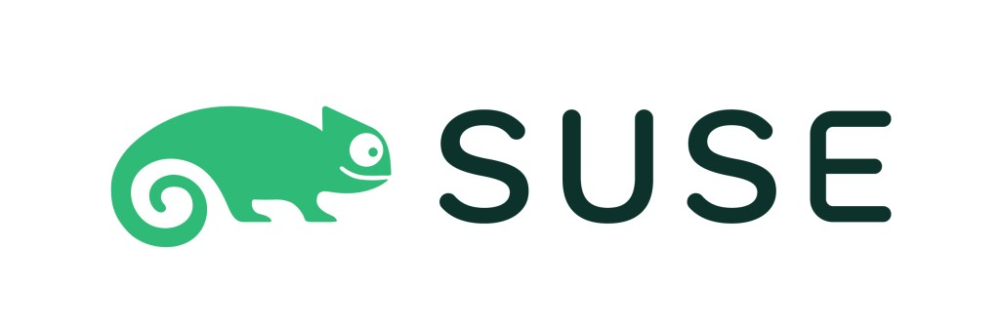
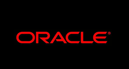
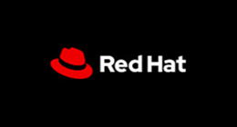
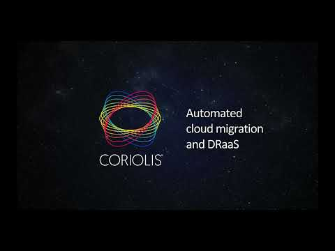
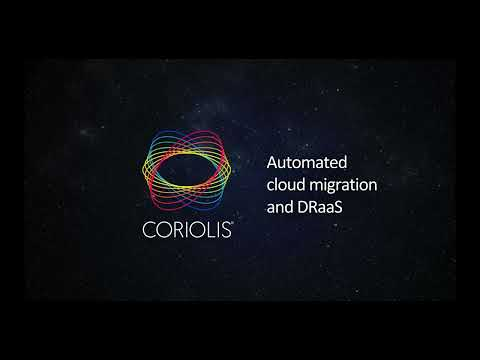
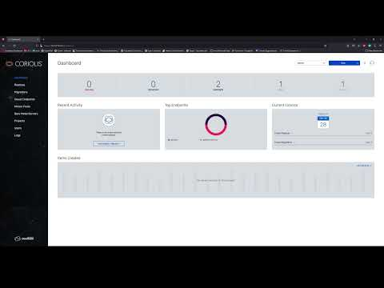
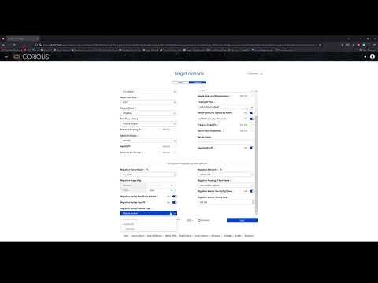

# Coriolis Overview

**Coriolis®** is a fully distributed and scalable system that provides both **"lift-and-shift" migration** services (CMaaS)
and **cross-site disaster recovery** features (DRaaS) between a source cloud platform and an independent destination cloud platform.

## Coriolis Customers and Partners

After thoroughly evaluating migration solutions, **Coriolis** emerged as the clear choice for many clients, some of whom are mentioned below. Their decision reflects the confidence in Coriolis to seamlessly orchestrate not only the cross-platform migrations but also as the preferred Disaster Recovery solution, making Coriolis a significant milestone in their IT strategy.

## Coriolis Training

A three-day hands-on course offered remotely will guide you through all aspects of performing effective operations on your Coriolis deployment. It will provide knowledge of Coriolis’ configuration, features, and functionality to understand the Replica and Migration processes better. The Coriolis Training can be customized to suit your needs. [Contact us](https://cloudbase.it/about/#contact) for more details.

## Videos

These are 2 demos showcasing the most common scenario of VMware to OpenStack migrations.

A full set of recordings for all supported platforms is available on our [YouTube channel Coriolis playlist](https://www.youtube.com/playlist?list=PL3wS6qV9GtxfGxhQyf7XtGVhiXdpE4FZ-).

### Bare Metal Hub Videos

