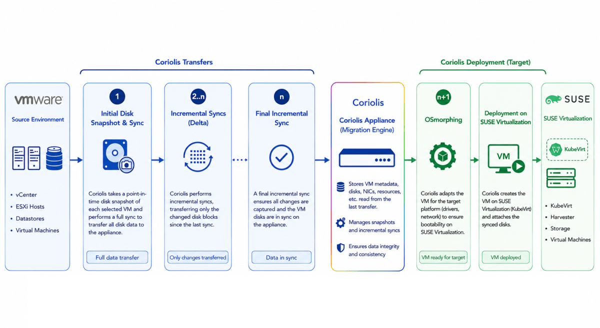
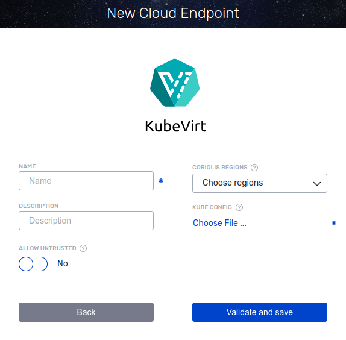
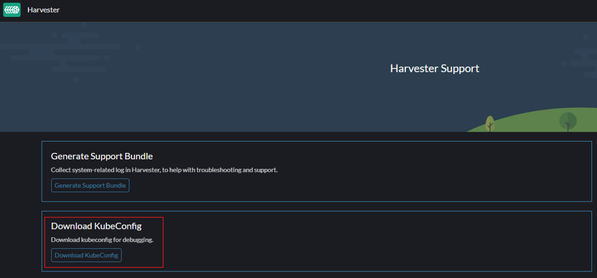

# KubeVirt and Harvester Coriolis Plugin

**Coriolis** provides agentless integration with supported virtualization platforms by running the platform plugin directly on the Coriolis Appliance. This architecture eliminates the need to deploy agents on source or destination platforms and simplifies connectivity and setup.

Coriolis has been validated for Harvester environments from **version 1.3 through 1.8.0**. This compatibility also extends to **SUSE Virtualization** , which is based on the same underlying platform capabilities.

For a VMware to SUSE Virtualization migration,  here is a representation of the steps involved:

## KubeVirt destination cloud

For detailed information regarding KubeVirt/Harvester capabilities and steps performed while using it as a destination cloud, please check the following page:

**[KubeVirt/Harvester as a destination cloud](https://cloudbase.it/kubevirt-harvester-as-a-destination-cloud/)**

## KubeVirt Endpoint Connection Parameters

To connect to Kubevirt to perform migration to it, the following connection parameters are required:

A valid kubeconfig YAML needs to be passed to the Coriolis endpoint. In a traditional KubeVirt setup, the kubeconfig can be found at the **~/.kube/config** location in your environment.

If using Harvester, a kubeconfig can be generated for the logged-in user by accessing the Harvester UI's Support page and clicking **Download KubeConfig** , as shown below.

## KubeVirt platform specifics

**Supported Actions:**| **Migration Destination - Replica Destination**| **Comments**  
---|---|---  
Plugin identifier| **kubevirt**|  Identifies the plugin Used for the **- provider** CLI parameter  
Credentials needed| kubeconfig that mentions either user TLS certificates or generated token| Necessary credentials to give to Coriolis  
Deployment requirements| Coriolis worker component(s) need network access to the Kubernetes and KubeVirt APIs| Coriolis deployment and environment connectivity requirements  
DRaaS source requirements| Kubevirt is not currently supported as a DRaaS source| Requirements to use the replica export (DRaaS source) features  
Instance identification scheme| Names must be unique| How instances to migrate/replicate are identified on a cloud handled by the plugin  
Network identification scheme| Names of VM Networks| How the plugin identifies networks. Required for the **network_map** field of the **- destination-environment**  
  
## KubeVirt migration user required permissions

This table will describe the minimum role requirements of a migration user to bind to migrate instances to a destination KubeVirt platform:

**Role Type**| **Resource**| **Access Level**| **API Group**  
---|---|---|---  
Cluster| virtualmachineimages| Read| harvesterhci.io  
 | volumesnapshotclasses| Read| snapshot.storage.k8s.io  
 | storageclasses| Read| storage.k8s.io  
 | namespaces| Read|    
 | network-attachment-definitions| Read| k8s.cni.cncf.io  
 | customresourcedefinitions| Read| apiextensions.k8s.io  
Namespace| persistentvolumeclaims| Read/Write|    
 | pods| Read/Write|    
 | virtualmachineinstances| Read/Write| kubevirt.io  
 | volumesnapshots| Read/Write| apiextensions.k8s.io  
 | volumesnapshots/status| Read| apiextensions.k8s.io  
 | virtualmachines| Read/Write| kubevirt.io  
 | virtualmachines/start| Read/Write| subresources.kubevirt.io
