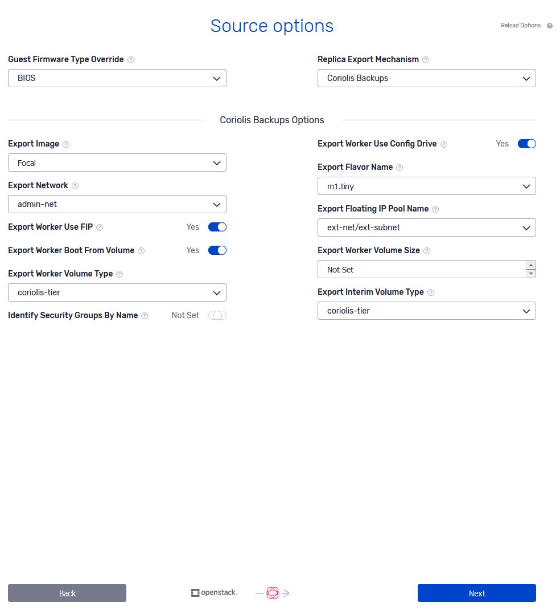

# OpenStack as a source cloud

### Migrating (CMaaS) from OpenStack

Transfer Migrations from OpenStack operate in the same way Transfer Replicas do and thus entail the same requirements and steps described below.

### Replicating (DRaaS) from OpenStack using Coriolis-based exports:

#### Requirements:

In the process of replicating from an OpenStack, Coriolis will clone locally the volumes of the source VM and boot a temporary worker VM on the source OpenStack to perform the actual disk exports.

**Input** : the ID or name (if and only if it is unique in the given tenant) of the instance to be replicated. The instance can be booted either from a Cinder volume or directly from a Glance image. 

NOTE please consider reviewing the general steps recommended to be performed before creating and executing a replica of an instance from OpenStack [her](https://cloudbase.it/preparing-a-vm-for-migration-replication/)[e](https://cloudbase.it/preparing-a-vm-for-migration-replication/).

**Steps performed by Coriolis** :

  1. read the configuration of the instance on the source OpenStack (flavor information, disks, etc…)
  2. if the instance was booted from a Glance image, a Nova snapshot is created for the instance, and the resulting Glance image is downloaded into a Cinder volume
  3. if the instance was booted from a Cinder volume or has any Cinder data disks attached, the disks are snapshotted and cloned to new Cinder volumes
  4. create a temporary worker VM (the "disk export worker") on the source OpenStack and attach the Cinder volumes from steps 2 and 3
  5. the **temporary disk export worker VM** will then determine the differences and export the contents of the attached Cinder volumes

After the above steps are completed, the contents of the disks will be transferred and written to disks on the destination via the destination cloud plugin. Only the changed data will be transferred to the destination cloud.

### Replicating (DRaaS) from OpenStack using Cinder-backup-based exports (through either Swift or Ceph):

This is referred to as the "Swift Backups" and "Ceph Backups" in the Replica Export Mechanism.

#### Requirements:

In the process of replicating from an OpenStack, Coriolis will use Cinder-backup to live-backup the volumes of the instance and fetch the data of the backups from Swift. Thus, the following extra requirements must be met by the source platform:

  * Cinder-backup must be installed and enabled
  * Cinder-backup must be configured to use either Swift/Ceph as the backup storage system

**Input** : the ID or name (if and only if it is unique in the given tenant) of the instance to be replicated. The instance must be booted from a Cinder volume to replicate through Cinder backups.

NOTE please consider reviewing the general steps recommended to be performed before creating and executing a replica of an instance from OpenStack [here](https://cloudbase.it/preparing-a-vm-for-migration-replication/).

**Steps performed by Coriolis** :

  1. read the configuration of the instance on the source OpenStack (flavor information, disks, etc…)
  2. create Cinder backups of all of the volumes of the instance with the Cinder backup API. If this is not the first replica, incremental backups/snapshots are performed
  3. fetch the backup data from the backup backend which was used (Swift or Ceph)

After the above steps are completed, the contents of the Cinder backups will be transferred and written to disks on the destination via the destination cloud plugin

### Replicating (DRaaS) from OpenStack using Cinder-volume and Ceph-based snapshots:

This is referred to as the "Ceph Snapshots" in the Replica Export Mechanism.

#### Requirements:

In the process of replicating from an OpenStack, Coriolis will use Cinder-snapshots to live-snapshot the volumes of the instance and fetch the data of the snapshots from Ceph. Thus, the following extra requirements must be met by the source platform:

  * Cinder-volume must be configured to use Ceph as a volume storage backend
  * All of the Cinder volumes of a given instance must be stored on a single Ceph cluster and pool

**Input** : the ID or name (if and only if it is unique in the given tenant) of the instance to be replicated. The instance must be booted from a Cinder volume to replicate. Coriolis cannot replicate instances booted off of Glance images.

NOTE please consider reviewing the general steps recommended to be performed before creating and executing a replica of an instance from OpenStack [here](https://cloudbase.it/preparing-a-vm-for-migration-replication).

**Steps performed by Coriolis** :

  1. read the configuration of the instance on the source OpenStack (flavor information, disks, etc…)
  2. create Cinder snapshots of all of the volumes of the instance using the standard Cinder snapshotting API
  3. fetch the snapshot data directly from Ceph through the RBD APIs. If this is not the first Replica Execution, only the changed disk areas for the previous snapshots are transferred

After the above steps are completed, the contents of the RBD images representing the Cinder volumes of the VM will be transferred and written to disks on the destination via the destination cloud plugin

### OSMorphing steps taken when migrating/replicating from OpenStack

Depending on the virtualization technology used and the OS release we are migrating/replicating, the following notable steps will be performed as part of the OSMorphing process:

**Linux** :

  * uninstalling cloud-init, if present
  * uninstalling Hyper-V integration tools, if source OpenStack is based on Hyper-V
  * uninstalling VMware integration tools, if source OpenStack is based on VMware

In Windows instances, the recommendation is to manually uninstall the VirtIO drivers or any integration tools, given that the destination cloud is different from the source one.

For more information regarding the Coriolis Worker template, please check the **[Coriolis Temporary Migration Worker](https://cloudbase.it/coriolis-temporary-migration-worker) **page.

### OpenStack source environment parameters

The source environment parameters are a set of source-cloud-specific parameters that offer some extra options to the migration/replication process on a per-VM basis.

Below is a listing of the source environment parameters the OpenStack plugin supports when migrating/replicating a VM from OpenStack:

**Source environment for OpenStack plugin**

{ "custom_os_type_map": { "redhat": "linux" }, "replica_export_mechanism": "swift_backups", "swift_backups_options": { "volume_backups_container": "coriolis" }, "coriolis_backups_options": { "export_interim_volume_type": "default-volume-type", "export_image": "bionic", "export_worker_use_config_drive": true, "export_network": "admin-net", "export_flavor_name": "m1.small", "export_worker_use_fip": true, "export_fip_pool_name": "floating-ip-net", "export_worker_boot_from_volume": false, "export_worker_volume_type": "default-volume-type", "export_worker_volume_size": 20, } }

12345678910111213141516171819 | {         "custom_os_type_map": { "redhat": "linux" },         "replica_export_mechanism": "swift_backups",         "swift_backups_options": {                 "volume_backups_container": "coriolis"         },         "coriolis_backups_options": {                "export_interim_volume_type": "default-volume-type",                "export_image": "bionic",                "export_worker_use_config_drive": true,                "export_network": "admin-net",                "export_flavor_name": "m1.small",                "export_worker_use_fip": true,                "export_fip_pool_name": "floating-ip-net",                "export_worker_boot_from_volume": false,                "export_worker_volume_type": "default-volume-type",                "export_worker_volume_size": 20,         } }  
---|---  
  
  * **custom_os_type_map (string)** - Custom mapping between the 'os_type' or 'os_distro' of Glance images on the source OpenStack. Mapping values must be one of the supported OS types in Coriolis.
  * **replica_export_mechanism (string)** - Replica export mechanism to use. Available mechanisms are "swift_backups", "ceph_backups", "ceph_snapshots", "coriolis_backups"
  * **swift_backups_options (object)** - Custom options for the "swift_backups" replica export mechanism
  * **volume_backups_container (string)** - Name of the Swift container to store volume backups. Only available "swift_backups" is chosen as the replica mechanism.
  * **coriolis_backups_options (object)** - Custom options for the "coriolis_backups" replica export mechanism.
  * **export_interim_volume_type (string)** - Name of pre-existing Cinder volume type on the source to use for the temporary volumes Coriolis will be creating for exporting instance Glance images. In the case of secondary volumes, the storage type already used by the individual volumes will be used to avoid a cross-backend volume transfer while the clone is occurring.
  * **export_image (string)** - Name or ID of a pre-existing Glance image of an Ubuntu 18.04 on the source OpenStack to be used for the temporary export worker VM on the source. The image must be available to the project/tenant provided in the Coriolis Endpoint. The image must have cloud-init installed and configured for the first boot.
  * **export_worker_use_config_drive (boolean)** - Whether or not to use config drive to send metadata to the temporary disk export worker VMs in case Neutron metadata is not available.
  * **export_network (string)** - Name or ID of an existing Neutron network on the source OpenStack where to attach the Neutron port of the temporary disk export worker VMs. The selected network must either be in the same project/tenant as set in the Coriolis endpoint or be a shared/external network and thus available to said project. If 'export_worker_use_fip' is set to false, the Coriolis installation must be able to route to addresses allocated from this network.
  * **export_flavor_name (string)** - Name of an existing Nova flavor to boot the temporary disk export worker VMs. The flavor must be compatible with the selected 'export_image'.
  * **export_worker_use_fip (boolean)** - Whether or not to allocate floating IPs from 'Export Floating IP Pool Name' for the temporary disk export worker VMs.
  * **export_fip_pool_name (string)** - Name of an external Neutron network from which to allocate floating IPs for the temporary worker VMs Coriolis boots up during the disk export process. The Coriolis installation must be able to route to addresses allocated from this network.
  * **export_worker_boot_from_volume (boolean)** - Whether or not to download the temporary disk export worker VM image to a Cinder volume and boot the worker from that.
  * **export_worker_volume_type (string)** - Name of pre-existing Cinder volume type to be used for the root disk of temporary disk export VMs. Only effective in 'export_worker_boot_from_volume' is set.
  * **export_worker_volume_size (integer)** - The integer size (in GBs) of the Cinder volume to boot temporary worker VMs from. This option is only effective if 'export_worker_boot_from_volume' is set. If not set, Coriolis will use the disk size set for the selected 'export_flavor_name'.

### Configuration Options

Below is a listing of the configuration section needed when replicating from an OpenStack:

**Configuration options for OpenStack as a DRaaS source**

[openstack_migration_provider] ### Export parameters: # Integer version of the Image API to use for any interactions with Glance, # supported versions being 1 and 2. # This value may be overriden on a per-cloud basis with the 'glance_api_version' # parameter in the endpoint connection info. # Default is 2 glance_api_version = 2 # Whether to skip certificate verification if the Swift proxy is HTTPS-only # with self-signed certificates. # This value may be overriden on a per-cloud basis with the # 'allow_untrusted_swift' parameter in the connection info. # Default is False allow_untrusted_swift = False # Custom mapping between the 'os_type' or 'os_distro' of Glance images on the # source OpenStack. Mapping values must be one of the supported OS types in # Coriolis. ('linux', 'windows', or 'solaris') # custom_os_type_map = # What Cinder implementation to leverage during replica exports. # If set to 'swift_backups', Coriolis will create Cinder backups for each # replicated VM disk and fetch the backup objects from Swift. # If set to 'ceph_backups', Coriolis will create Cinder backups and connect # to the source OpenStack's Ceph via RADOS to retrieve the chunks of each disk. # If set to 'ceph_snapshots', Coriolis will create Cinder snapshots for each disk # and fetch the diff chunks from the source OpenStack's Ceph. # Both the 'ceph_backups' and 'ceph_snapshots' options require that the # coriolis-worker component have network access to the source OpenStack's Ceph # through librbd/librados. # If set to 'coriolis_backups', Coriolis will create a temporary VM on the source # and use its in-built Replication engine through it to diff/export the disks. # Only the 'coriolis_backups' mechanism works for VMs which were booted from a # Glance image, and all other options only work on Cinder-based VMs. # Default is 'swift_backups' replica_export_mechanism = swift_backups ## Options for 'replica_export_mechanism = swift_backups' # The name of the Swift container in which to store the Cinder backups. # If pre-existing, the container will be reused. If it doesn't exist, a new one # will be created. # Default is 'coriolis' volume_backups_container = coriolis ## Options for 'replica_export_mechanism = ceph_backups/snapshots' # Integer timeout (seconds) when connecting to Ceph. # Default is 30 cinder_ceph_timeout = 30 # String name of algorith in Python's hashlib to use for hashing disk chunks to # compare them. If unset, the diff will be compared directly instead of hashing. # cinder_ceph_backups_diff_hash_algorithm = None ## Options for 'replica_export_mechanism = coriolis_backups' # Name or ID of a pre-existing Glance Ubuntu 18.04 image on the source OpenStack # to be used for the temporary export worker VM on the source. The image must be # available to the project/tenant provided in the Coriolis Endpoint. The images # must have cloud-init installed and configured for first boot. # export_image = ubuntu-18.04-coriolis-worker # Name of pre-existing Cinder volume type on the source to use for the temporary # volumes Coriolis will be creating for exporting instance Glance images. In the # case of secondary volumes, the storage type already used by the individual # volumes will be used to avoid a cross-backend volume transfer while the clone # is occurring. If unset, the default Cinder volume type will be used. # export_interim_volume_type = # Whether or not to download the worker image to a Cinder volume and boot the # worker from that. The root disk size" on the configured 'export_flavor_name' # will be used for the worker VM volume. export_worker_boot_from_volume = false # Name of the precreated Cinder volume type to use when creating temporary worker volumes. # This option is only effective if "export_worker_boot_from_volume" is set. # export_worker_volume_type = cinder-volume-type # The integer size (in GBs) of the Cinder volume to boot temporary worker VMs from. # This option is only effective if "export_worker_boot_from_volume" is set. If not set, # Coriolis will use the disk size set the selected "export_flavor_name". # export_worker_volume_size = 100 # Name of the flavor to use for the temporary disk export VM. # The flavor must be compatible with the selected 'export_image'. # export_flavor_name = m1.small # Name or ID of an existing Neutron network on the source OpenStack where to attach # the Neutron port of the temporary disk export worker VMs. The selected network # must either be in the same project/tenant as set in the Coriolis endpoint or # be a shared/external network and thus available to said project. If # export_worker_use_fip is set to 'false', the Coriolis installation must be # able to route to addresses allocated from this network." # export_network = external-network-name # Whether or not to allocate floating IPs from 'export_fip_pool_name' for the # temporary disk export worker VMs. # Default is true # export_worker_use_fip = true # Name of an external Neutron network from which to allocate floating IPs for the # temporary worker VMs Coriolis boots up during the disk export process. The # Coriolis installation must be able to route to addresses allocated from this network. # export_fip_pool_name = external # Whether or not to use config drive to send metadata to the temporary disk disk # export worker VMs in case Neutron metadata is not available. Default is false. # export_worker_use_config_drive = false # Whether or not Coriolis should reference security groups by name instead of ID. # This option may be required for older source OpenStacks whose Nova service is # incapable of identifying security groups by ID. # Default is false # export_identify_secgroups_by_name = true # Whether or not Coriolis should wait for export cloned volumes to delete when # replication finishes. Setting this option to true will also affect the replica # execution's RPO. Some Cinder drivers require this option for the proper # sequential cleanup of Cinder snapshots which have child volumes created from them. # wait_for_volume_deletion = false

123456789101112131415161718192021222324252627282930313233343536373839404142434445464748495051525354555657585960616263646566676869707172737475767778798081828384858687888990919293949596979899100101102103104105106107108109110111112113114115116117118119120121122123 | [openstack_migration_provider]### Export parameters: # Integer version of the Image API to use for any interactions with Glance,# supported versions being 1 and 2.# This value may be overriden on a per-cloud basis with the 'glance_api_version'# parameter in the endpoint connection info.# Default is 2glance_api_version = 2 # Whether to skip certificate verification if the Swift proxy is HTTPS-only# with self-signed certificates.# This value may be overriden on a per-cloud basis with the# 'allow_untrusted_swift' parameter in the connection info.# Default is Falseallow_untrusted_swift = False # Custom mapping between the 'os_type' or 'os_distro' of Glance images on the# source OpenStack. Mapping values must be one of the supported OS types in# Coriolis. ('linux', 'windows', or 'solaris')# custom_os_type_map = # What Cinder implementation to leverage during replica exports.# If set to 'swift_backups', Coriolis will create Cinder backups for each# replicated VM disk and fetch the backup objects from Swift.# If set to 'ceph_backups', Coriolis will create Cinder backups and connect# to the source OpenStack's Ceph via RADOS to retrieve the chunks of each disk.# If set to 'ceph_snapshots', Coriolis will create Cinder snapshots for each disk# and fetch the diff chunks from the source OpenStack's Ceph.# Both the 'ceph_backups' and 'ceph_snapshots' options require that the# coriolis-worker component have network access to the source OpenStack's Ceph# through librbd/librados.# If set to 'coriolis_backups', Coriolis will create a temporary VM on the source# and use its in-built Replication engine through it to diff/export the disks.# Only the 'coriolis_backups' mechanism works for VMs which were booted from a# Glance image, and all other options only work on Cinder-based VMs.# Default is 'swift_backups'replica_export_mechanism = swift_backups ## Options for 'replica_export_mechanism = swift_backups' # The name of the Swift container in which to store the Cinder backups.# If pre-existing, the container will be reused. If it doesn't exist, a new one# will be created.# Default is 'coriolis'volume_backups_container = coriolis ## Options for 'replica_export_mechanism = ceph_backups/snapshots' # Integer timeout (seconds) when connecting to Ceph.# Default is 30cinder_ceph_timeout = 30 # String name of algorith in Python's hashlib to use for hashing disk chunks to# compare them. If unset, the diff will be compared directly instead of hashing.# cinder_ceph_backups_diff_hash_algorithm = None ## Options for 'replica_export_mechanism = coriolis_backups' # Name or ID of a pre-existing Glance Ubuntu 18.04 image on the source OpenStack# to be used for the temporary export worker VM on the source. The image must be# available to the project/tenant provided in the Coriolis Endpoint. The images# must have cloud-init installed and configured for first boot.# export_image = ubuntu-18.04-coriolis-worker # Name of pre-existing Cinder volume type on the source to use for the temporary# volumes Coriolis will be creating for exporting instance Glance images. In the# case of secondary volumes, the storage type already used by the individual# volumes will be used to avoid a cross-backend volume transfer while the clone# is occurring. If unset, the default Cinder volume type will be used.# export_interim_volume_type = # Whether or not to download the worker image to a Cinder volume and boot the# worker from that. The root disk size" on the configured 'export_flavor_name'# will be used for the worker VM volume.export_worker_boot_from_volume = false # Name of the precreated Cinder volume type to use when creating temporary worker volumes.# This option is only effective if "export_worker_boot_from_volume" is set.# export_worker_volume_type = cinder-volume-type # The integer size (in GBs) of the Cinder volume to boot temporary worker VMs from.# This option is only effective if "export_worker_boot_from_volume" is set. If not set,# Coriolis will use the disk size set the selected "export_flavor_name".# export_worker_volume_size = 100 # Name of the flavor to use for the temporary disk export VM.# The flavor must be compatible with the selected 'export_image'.# export_flavor_name = m1.small # Name or ID of an existing Neutron network on the source OpenStack where to attach# the Neutron port of the temporary disk export worker VMs. The selected network# must either be in the same project/tenant as set in the Coriolis endpoint or# be a shared/external network and thus available to said project. If# export_worker_use_fip is set to 'false', the Coriolis installation must be# able to route to addresses allocated from this network."# export_network = external-network-name # Whether or not to allocate floating IPs from 'export_fip_pool_name' for the# temporary disk export worker VMs.# Default is true# export_worker_use_fip = true # Name of an external Neutron network from which to allocate floating IPs for the# temporary worker VMs Coriolis boots up during the disk export process. The# Coriolis installation must be able to route to addresses allocated from this network.# export_fip_pool_name = external # Whether or not to use config drive to send metadata to the temporary disk disk# export worker VMs in case Neutron metadata is not available. Default is false.# export_worker_use_config_drive = false # Whether or not Coriolis should reference security groups by name instead of ID.# This option may be required for older source OpenStacks whose Nova service is# incapable of identifying security groups by ID.# Default is false# export_identify_secgroups_by_name = true # Whether or not Coriolis should wait for export cloned volumes to delete when# replication finishes. Setting this option to true will also affect the replica# execution's RPO. Some Cinder drivers require this option for the proper# sequential cleanup of Cinder snapshots which have child volumes created from them.# wait_for_volume_deletion = false  
---|---
