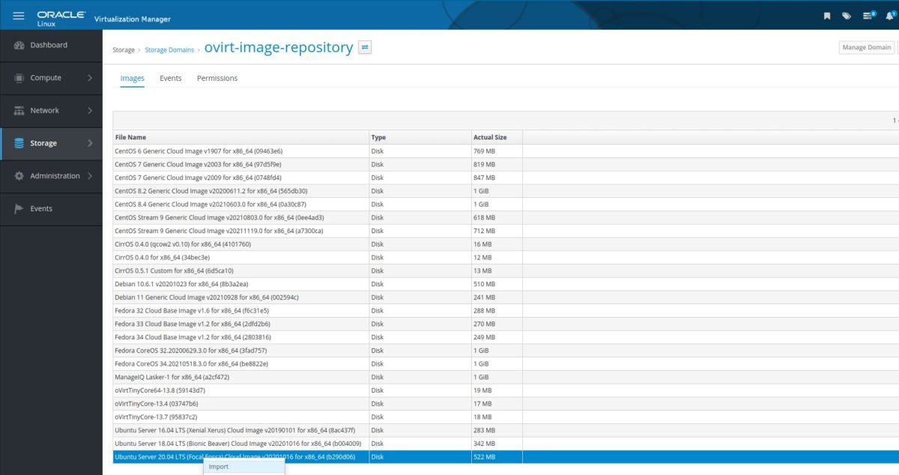
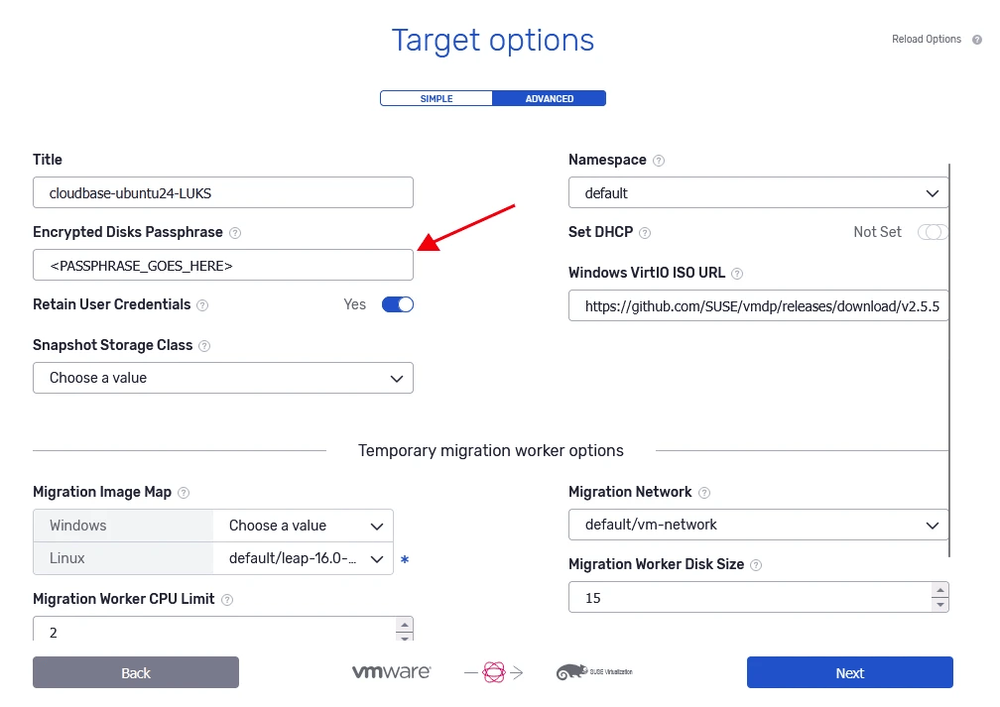

# oVirt as a destination cloud

**NOTE: Both OLVM and RHEV are considered oVirt platforms in the Coriolis documentation pages and therefore all notes about the oVirt platform will apply to both the OLVM and RHEV providers.**  
  
### **Migrating (CMaaS) to oVirt**

Migrations to oVirt operate like Replicas do and thus entail the same requirements and steps described below.

### **Replicating (DRaaS) to oVirt**

#### Replica executions:

**Steps performed by Coriolis** :

  1. if this is the first replica execution for the VM, create empty disks on oVirt, each matching the specifications of a disk the VM had on the source. If this is a later replica execution, the previously created volumes are used
  2. if this is the first replica execution of the VM, create a new live snapshot of the disks of the VM on the source cloud (handled by whatever source cloud plugin we are using). If this is a later replica execution, create a new live snapshot based on the one from the last successful replica execution
  3. create a temporary Linux worker VM in oVirt (the “disk copy worker”) on the destination cloud and attach the volumes from Step 1 to it
  4. read the contents of the snapshot created at step 2 via the source platform’s snapshot/backup APIs (handled by whatever source cloud plugin we are using), transferring the written chunks to the temporary VM created in step 3, which then writes the chunks at the appropriate index/offset of the disks made at step 1
  5. once the contents of all the disks have been synced to the volumes created in Step 1, detach the volumes and delete the disk copy worker made in Step 3

#### Replica deployments:

**Steps performed by Coriolis** :

  1. create snapshots of the previously replicated volumes on the oVirt to be able to roll back any changes. By default, new volumes are made from these snapshots, leaving the original replica volumes intact for future replica executions
  2. depending on the OS of the VM whose replica is being deployed, boot a temporary worker VM (“the OSMorphing worker”) with the same OS type on the destination cloud, and attach the volumes from step 1 to it
  3. perform the “OSMorphing process”, where Coriolis commands the OSMorphing worker created at step 2 to scan all attached disks for the OS installation of the VM we are migrating, mount, and perform the steps needed to prepare the installation for the new platform (ex: uninstalling the VMWare guest tools and installing VirtIO drivers)
  4. detach the volumes created at step 1 from the OSMorphing worker created at step 2 and delete the temporary worker VM
  5. create and boot the migrated VM on oVirt with the specifications of the original VM on the source cloud (which have been noted during the replica execution we are deploying), creating and attaching any necessary NICs and volumes.

### Temporary worker image for Replica/Migration

When choosing to run a task of **Replica/Migration** to **oVirt** , there will have to be VM templates on the destination platform having a set username and password for the Coriolis worker to access and use as a temporary VM.

The **VM templates** need to have the IDs all zeroed, like the default **oVirt** image created. In a case where that image is no longer existent or was changed, a new image must be created.

The most common way to create the image Coriolis needs is to import 'as template' one of the images found in the '**ovirt-image-repository** ', as seen below

Once the image is imported as a template, a new VM must be created using it and verify if '**qemu-guest-agent** ' is installed:

  * on Linux distributions check '**systemctl status qemu-guest-agent** '
  * on a Windows machine check for the **VirtIO drivers** as the **qemu-guest-agent** is included in the VirtIO drivers

#### Installing Qemu Guest Agent when not present

If the agent is not present install it on the machine and save it as a template afterward.  
On Ubuntu or Debian derivatives, run:

apt update && apt -y install qemu-guest-agent systemctl enable --now qemu-guest-agent systemctl status qemu-guest-agent

123 | apt update && apt -y install qemu-guest-agentsystemctl enable \--now qemu-guest-agentsystemctl status qemu-guest-agent  
---|---  
  
On RedHat Linux derivatives, run:

yum install -y qemu-guest-agent systemctl enable --now qemu-guest-agent systemctl status qemu-guest-agent

123 | yum install -y qemu-guest-agentsystemctl enable \--now qemu-guest-agentsystemctl status qemu-guest-agent  
---|---  
  
On Windows, download the VirtIO drivers using the [**official archive**](https://fedorapeople.org/groups/virt/virtio-win/direct-downloads/archive-virtio/), copy on or attach it to the machine, and use the .iso image for the following:

  * Install **VirtIO drivers** by running the .exe file
  * Install **qemu-guest-agent** using the .exe file

#### Post-completion

After completing the **qemu-guest-agent** install, depending on the OS type selected **Linux or Windows** , follow the [**temporary worker**](https://cloudbase.it/coriolis-temporary-migration-worker) page for the completing steps.

**Note:** For Windows VMs, the temporary worker image version must be at least the same as the OS of the VM that needs to be migrated.

### OSMorphing steps taken when migrating/replicating to oVirt

Depending on the OS release being migrated/replicated, the following notable steps will be performed as part of the OSMorphing process:

**Linux:**

  * install guest agent (ovirt-guest-agent or qemu-guest-agent)

**Windows:**

  * installing the VirtIO drivers - as per the below section

### Migrating Windows VMs

When migrating Windows VMs, the OSMorphing workers need to install VirtIO drivers to the migrated Windows VMs to make sure they boot properly on oVirt. 

The user needs to self-host the drivers using their Oracle account, by accepting Oracle's EULA and downloading the ZIP file containing the drivers. Downloading steps can be found [here](https://docs.oracle.com/en/operating-systems/oracle-linux/kvm-virtio/kvm-virtio-DownloadingtheOracleVirtIODriversforMicrosoftWindows.html#kvm-virtio-download) under the **Downloading the Oracle VirtIO Drivers** section.

As of June 2024, the latest version of the **Oracle VirtIO Drivers Version for Microsoft Windows is 2.1.0** , the archive filename is **V1037432-01.zip** (44.4 MB).

Please ensure that the zip archive contains the file "winvirtio.iso" as Coriolis will be requiring that to slipstream the Windows VirtIO drivers.

The ZIP file's URL is then used in the Migration/Replica settings or can be passed to the **windows_virtio_zip_url** configuration option in **coriolis.conf**.

Refer to the [Oracle VirtIO Drivers for Microsoft Windows for Use With KVM page](https://docs.oracle.com/en/operating-systems/oracle-linux/kvm-virtio/kvm-virtio-WhatsNew.html#kvm-virtio-supported-os) for more details on the VirtIO drivers support matrix for Windows guest versions.

### Disk copy worker templates

During the migration process to/from oVirt, Coriolis creates a temporary worker VM to which it attaches snapshots of the original instance’s disks to read them through it.

The disk reading process involves transmission over an SSH channel, so both security and transfer efficiency should be maximized.

Depending on the Coriolis configuration, the disk copy worker might have to do some decompression itself, which is why it is recommended the Worker VM template be configured to be more compute-capable (CPU/RAM), as a minimum the Worker **VM template** should have **2 CPU cores** and **2GB of memory**.

The images do **NOT** require any special Coriolis agent running in them and can be images already available on oVirt, granted the following requirements:

  * When Migrating a Windows VM, **[the temporary worker image](https://cloudbase.it/coriolis-temporary-migration-worker)** version used for the temporary worker**must be the same** as the one for the VM replicated/migrated or **newer**.
  * image must have **VirtIO drivers** and ovirt **guest agent/qemu guest agent**  
For VirtIO drivers, please follow the **[official page](https://docs.fedoraproject.org/en-US/quick-docs/creating-windows-virtual-machines-using-virtio-drivers/)** for download for the community drivers, or use the Oracle VirtIO drivers.

## Configuration Options

Below is a listing of the configuration section needed when migrating/replicating to oVirt:

**Configuration options for oVirt as a destination**

[ovirt_migration_provider] ### General parameters: # Name or ID of a blank template to be used for a temporary VM through # which disk snapshots will be managed. The template should ideally be # blank (i.e. have no attached disks) in order to facilitate cloning times. # Internal default is '00000000-0000-0000-0000-000000000000'. # default_migr_blank_template = "00000000-0000-0000-0000-000000000000" ### Import parameters: # Name or ID of the cluster to migrate machines to. # default_cluster = Default # Name or ID of a pre-existing oVirt storage domain to be # used for the disks of migrated VMs. The storage domain's # type must be either 'data' or 'managed block storage'. # default_storage_domain = "" # Whether or not to use thin provisioning for disks # created on the target oVirt. default_use_thin_disk_allocation = True # Name or ID of a pre-existing VM pool on oVirt to add migrated VMs to. # default_vm_pool = "" # Name of the OS release to use for migrated machines. # Internal default is 'other_linux'. # Default optimization setting for migrated machines. # Internal default is 'server'. # default_optimized_for = "server" # Default setting for deletion protection on migrated machines. # default_delete_protected = False # Whether or not Coriolis should skip starting the migrated # VM(s) on oVirt after creating them. # Internal default is False. # default_leave_migrated_vms_off = false # Name or ID of a pre-existing cluster to boot temporary minion # machines in. If left unset, the main 'default_cluster' selected for # the import will be used. # default_migr_minion_cluster = Default # "Mapping between operating system types ('linux' or 'windows') and the # names or IDs of pre-existing templates on oVirt to be used for temporary # machines Coriolis will be spawning to perform various operations. Both # templates should either have a pre-defined username and password set # within them, or have cloud-init installed and configured for an # initial run. The Linux template will be used for data transfer and # OSMorphing of Linux machines, and must of an up-to-date Linux release # and be configured to listen for SSH connection on port 22. The Windows # template will strictly be used Windows OSMorphing and must be set # up with WinRM/HTTPS on port 5986. # default_migr_template_map = linux: Bionic-passworded, windows: WS2016 # Mapping between operating system types ('linux' or 'windows') and the # pre-set usernames of the respective templates set using the # 'default_migr_template_map' option. The users must have admin rights # and allow for passwordless sudo on Linux. If no user or password is # provided, cloud-init-based initialization is attempted. # default_migr_template_username_map = linux: coriolis, windows: coriolis # Mapping between operating system types ('linux' or 'windows') and the # pre-set password for the users specified within the # 'default_migr_template_username_map' option for the templates provided # using the 'Migration Minion Template Map' option. If no user or password # is provided, cloud-init-based initialization is attempted. # default_migr_template_password_map = linux: Passw0rd, windows: Passw0rd # Name or ID of a pre-existing storage domain to boot temporary # minion machines in. If left unset, the default storage domain # on the minion machine template will be used. # default_migr_minion_storage_domain = "" # What mechanism to use when sending disk data from the Coriolis installation # to the temporary VMs on the target oVirt to be written to their # respective disk. The HTTPS-based transfer mechanism (TCP/5566) is faster but # might not work if there are firewalls in the way. The SSH-based transfer # mechanism (TCP/22) is more costly but will be allowed by most firewalls since # SSH access from the Coriolis installation to the temporary worker VM is always # required. Coriolis automatically sets security groups rules for the temporary # VMs accordingly. # Choices are 'SSH' or 'HTTPS'. Default is 'HTTPS'. data_transfer_mechanism = HTTPS

12345678910111213141516171819202122232425262728293031323334353637383940414243444546474849505152535455565758596061626364656667686970717273747576777879808182838485 | [ovirt_migration_provider]### General parameters:# Name or ID of a blank template to be used for a temporary VM through# which disk snapshots will be managed. The template should ideally be# blank (i.e. have no attached disks) in order to facilitate cloning times.# Internal default is '00000000-0000-0000-0000-000000000000'.# default_migr_blank_template = "00000000-0000-0000-0000-000000000000" ### Import parameters: # Name or ID of the cluster to migrate machines to.# default_cluster = Default # Name or ID of a pre-existing oVirt storage domain to be# used for the disks of migrated VMs. The storage domain's# type must be either 'data' or 'managed block storage'.# default_storage_domain = "" # Whether or not to use thin provisioning for disks# created on the target oVirt.default_use_thin_disk_allocation = True # Name or ID of a pre-existing VM pool on oVirt to add migrated VMs to.# default_vm_pool = "" # Name of the OS release to use for migrated machines.# Internal default is 'other_linux'. # Default optimization setting for migrated machines.# Internal default is 'server'.# default_optimized_for = "server" # Default setting for deletion protection on migrated machines.# default_delete_protected = False # Whether or not Coriolis should skip starting the migrated# VM(s) on oVirt after creating them.# Internal default is False.# default_leave_migrated_vms_off = false # Name or ID of a pre-existing cluster to boot temporary minion# machines in. If left unset, the main 'default_cluster' selected for# the import will be used.# default_migr_minion_cluster = Default # "Mapping between operating system types ('linux' or 'windows') and the# names or IDs of pre-existing templates on oVirt to be used for temporary# machines Coriolis will be spawning to perform various operations. Both# templates should either have a pre-defined username and password set# within them, or have cloud-init installed and configured for an# initial run. The Linux template will be used for data transfer and# OSMorphing of Linux machines, and must of an up-to-date Linux release# and be configured to listen for SSH connection on port 22. The Windows# template will strictly be used Windows OSMorphing and must be set# up with WinRM/HTTPS on port 5986.# default_migr_template_map = linux: Bionic-passworded, windows: WS2016 # Mapping between operating system types ('linux' or 'windows') and the# pre-set usernames of the respective templates set using the# 'default_migr_template_map' option. The users must have admin rights# and allow for passwordless sudo on Linux. If no user or password is# provided, cloud-init-based initialization is attempted.# default_migr_template_username_map = linux: coriolis, windows: coriolis # Mapping between operating system types ('linux' or 'windows') and the# pre-set password for the users specified within the# 'default_migr_template_username_map' option for the templates provided# using the 'Migration Minion Template Map' option. If no user or password# is provided, cloud-init-based initialization is attempted.# default_migr_template_password_map = linux: Passw0rd, windows: Passw0rd# Name or ID of a pre-existing storage domain to boot temporary# minion machines in. If left unset, the default storage domain# on the minion machine template will be used.# default_migr_minion_storage_domain = "" # What mechanism to use when sending disk data from the Coriolis installation# to the temporary VMs on the target oVirt to be written to their# respective disk. The HTTPS-based transfer mechanism (TCP/5566) is faster but# might not work if there are firewalls in the way. The SSH-based transfer# mechanism (TCP/22) is more costly but will be allowed by most firewalls since# SSH access from the Coriolis installation to the temporary worker VM is always# required. Coriolis automatically sets security groups rules for the temporary# VMs accordingly.# Choices are 'SSH' or 'HTTPS'. Default is 'HTTPS'.data_transfer_mechanism = HTTPS  
---|---
